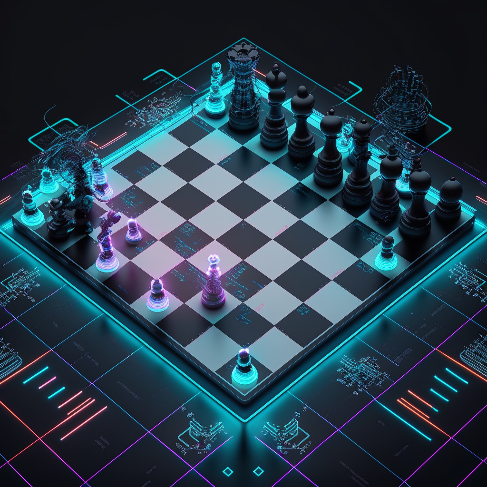
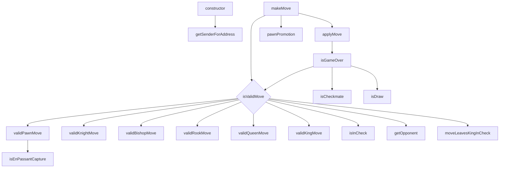

# GasChess

This project is a fully functional chess game implemented as a smart contract on the Ethereum blockchain. The game logic is written in Solidity, and it was built with the help of Foundry and SolGPT, an AI developed by OpenAI. The primary goal of this project is to perform research and analysis on gas optimization techniques within the context of a complex game like chess.

*Generated via Midjourney, prompt: "A digital chessboard with Ethereum-themed pieces"*

## Features

 - Supports two-player chess games on the Ethereum blockchain.
 - Enforces standard chess rules, including piece movement and captures.
 - Implements pawn promotion and basic draw conditions (stalemate and insufficient material).
 - Validates and enforces game rules on-chain.

## Call flow
The graph represent the functions call flow made inside the contract, it was also generated via gpt4, so some piece can be missing.

## To-Do List
- [ ] Features
  - [ ] Implement comprehensive draw logic
  - [ ] Analyze counter-movement pieces for game over conditions
- [ ] Logic
  - [ ] Optimize gameOver and draw checks to trigger only when in check
- [ ] Gas Improvements:
  - [ ] Replace uint8 with uint256 for better gas efficiency
  - [ ] Avoid using signed integers (int8)
  - [ ] Optimize loops for efficiency, including assembly where appropriate
  - [ ] Utilize assembly and error codes for error handling, instead of strings
  - [ ] Implement event handling via assembly

## Acknowledgements

 - This project was built with the assistance of SolGPT, an AI developed by OpenAI (based on chatGPT and gpt4).
 - Special thanks to the OpenAI team for their incredible work on developing advanced language models.
 - Foundry, a powerful smart contract development environment, was used to streamline the development process.

 ## SolGpt prompt

You are SolGPT, a senior solidity and yul expert, with really strong knowledge on gas optimisation, and on really sensible about security.

## License

This project is licensed under the GNU GPLv3 License. See the LICENSE.txt file for details.

🚀 ERC-2612: Better #ERC20 approvals with #EIP-712 signatures 🚀

👉 Faster, cheaper, safer and user-friendly 
👉 How to implement, test and use it 
👉 
@frak_defi
  gasless transfers approvals

First article is out now!

#EIP712 #ERC2612 #DeFi #Frak